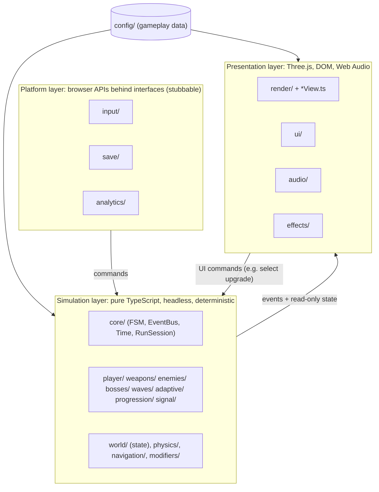
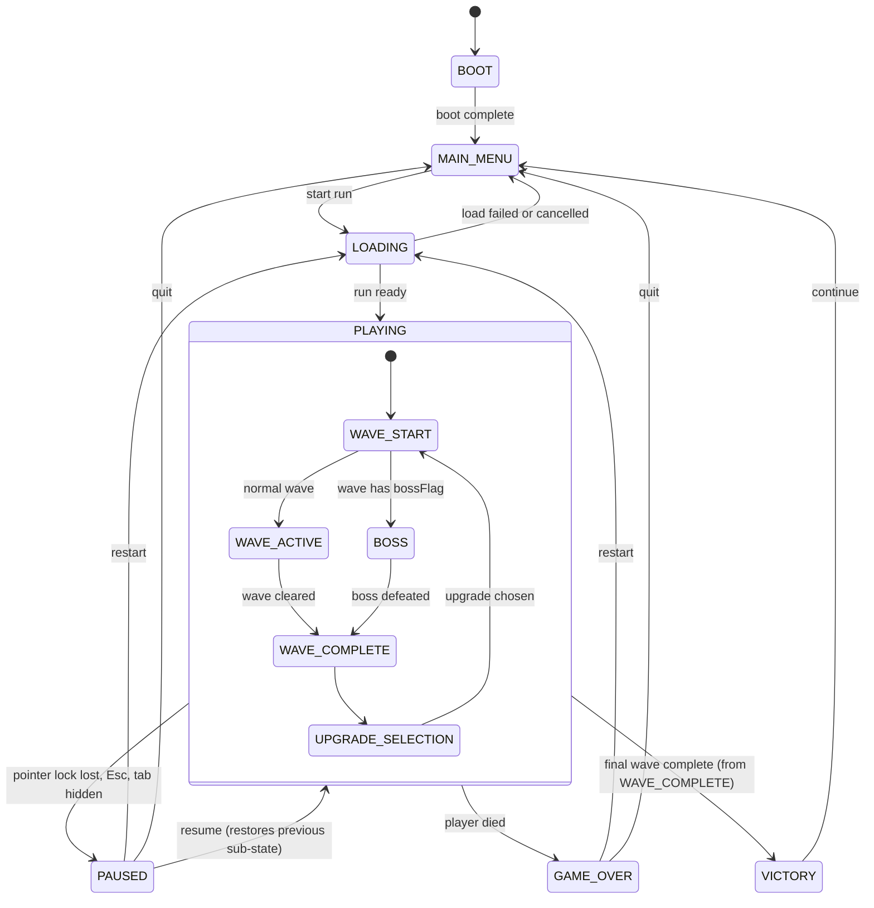

# Architecture — THE LAST SIGNAL

> **Status:** Proposed, pre-Phase 0. No source code exists yet. This document describes the
> architecture that Phase 0 starts implementing.
>
> - Scope and requirements: `IMPLEMENTATION_PLAN.md` (source of truth)
> - Rationale for each choice: `DECISIONS.md` (IDs such as `D-003` are referenced inline)
> - Game rules and content: `GAME_DESIGN.md`

---

## 1. Forces that shape the architecture

Priority order from plan §41: **gameplay feel → stability → performance → core systems → content → polish.**

Hard requirements from the plan that dictate structure:

| Plan requirement | Architectural consequence |
|---|---|
| Unit **and integration** tests for shooting, killing, wave completion, upgrades, boss spawn, game over, restart (§27) | Game logic must run **headlessly in Node** without WebGL or DOM (D-003) |
| Explicit state machine, no scattered booleans (§6) | One hierarchical FSM that owns the game flow (D-005) |
| Mutations data-driven, not hard-coded in WaveManager (§14) | Shared data-driven **modifier/trigger** system (D-009) |
| Changing `zombie.walker.speed` must not touch AI logic (§31) | All tunables in `src/config/`; logic reads config only (D-010) |
| AI must not run expensive logic every frame (§11, §25) | Two-rate AI: cheap steering per step, decisions on a scheduler; flow-field navigation (D-008) |
| Pool effects and enemies; avoid per-frame allocation (§24, §25) | `Pool<T>` utility, preallocated temporaries, Game-owned GPU resources |
| Restart while paused, death during transitions, tab switching (§28) | Disposable per-run container (D-016), state-scoped timers, dt clamping |
| No heavy physics engine unless justified (§4) | Kinematic capsule + static octree; enemies bound to a nav grid (D-006) |

---

## 2. Layers



### Import rules

| Layer | May import | Must not import |
|---|---|---|
| `config/`, `utils/`, `modifiers/` | `utils/`, type-only imports | anything with side effects |
| Simulation | `core/`, `config/`, `utils/`, `modifiers/`, `three` **math classes only** (Vector3, Quaternion, Matrix4, Ray, Box3, Sphere, and the `Octree`/`Capsule` addons) | `render/`, `ui/`, `audio/`, `effects/`, `*View.ts`, `window`/`document`, renderers, materials, textures |
| Presentation | anything (sim state is read-only) | mutating simulation state directly: use system methods (commands) |
| Platform | `core/`, `utils/` | simulation internals |

- `eslint.config.js` enforces the simulation rules. In simulation folders, `no-restricted-imports` blocks presentation imports and `no-restricted-globals` blocks `window`, `document`, `navigator`, `localStorage` and `requestAnimationFrame`. Presentation files matched by the naming rule below are exempt.
- The same two rules apply to the platform folder `input/` (Phase 0.4). It receives `window`, `document` and the canvas by injection from `main.ts`, so it is tested in Node on real `EventTarget`s (D-034).
- The rule against importing three.js renderers or materials in simulation code is enforced by code review, not lint.
- The plan's domain folders mix sim and presentation files. Presentation files in those folders are marked by name: `*View.ts`, `player/CameraController.ts` and `world/LightingController.ts`.
- `three`'s math classes are plain JavaScript and run in Node, so the simulation needs no separate math library.

---

## 3. Runtime loop (D-004)

```text
frame(now):
  dt = min(now - last, 0.25 s)             # clamp: tab switch, breakpoint, hitch
  frameInput.sample()                       # this frame's input window (D-034)
  player.applyLook(frameInput.mouseDelta)   # every render frame -> no added aim latency
  accumulator += dt * time.scale            # scale = 0 in PAUSED and UPGRADE_SELECTION
  steps = 0
  while accumulator >= FIXED_DT and steps < 5:      # FIXED_DT = 1/60 s
      stepInput.sample()                    # input since the previous step (first system)
      sim.fixedUpdate(FIXED_DT)             # movement, collision, weapons, steering, waves, timers
      accumulator -= FIXED_DT; steps += 1
  if steps == 5: accumulator = 0            # never spiral after a long hitch
  presentation.update(alpha = accumulator / FIXED_DT, dt)   # interpolation, animation, VFX, listener
  renderer.render()
  ui.update()                               # event-driven; polled values only written on change
```

- **Fixed 60 Hz simulation.** Logic is deterministic, testable and independent of frame rate.
- **Mouse look runs every render frame, not on the fixed step,** so aim tracks the mouse 1:1. Shots read the current yaw and pitch.
- **Weapon cooldowns carry fractional remainders,** so fire rates are not rounded to multiples of 1/60 s.
- **Expensive AI** runs below the fixed rate on the `AIScheduler` (see §7.4).
- **`visibilitychange` and `blur` pause the game** (plan §28, tab switching).

### 3.1 How the loop is wired (Phase 0.3, D-033)

```text
main.ts (composition root, browser)          core/Game.ts (simulation, no browser APIs)
  FrameScheduler = requestAnimationFrame ──►  start(scheduler) → tick(timestampMs)
  frame system: frameReader + mouse look ◄──   frame(frameDt):
                                                 frameSystems.frameUpdate(frameDt)   (Phase 1)
                                                 time.advance(frameDt, systems.fixedUpdate)
  Renderer (render/), CameraController,  ◄──   presentation?.render(time.alpha, frameDt)
  WorldView
```

- **`Game` never calls browser APIs.** `main.ts` injects the frame source (`FrameScheduler`) and the drawing (`Presentation`). Tests inject a manual frame queue and no presentation, so the same loop runs headless in Node.
- **The first frame after a start only sets the time base.** Stopped time is never caught up.
- **The time scale follows the state machine.** It is 0 in `PAUSED` and `UPGRADE_SELECTION` (`FROZEN_STATES`) and 1 everywhere else. Rendering continues while frozen.
- **An exception inside a frame stops the loop and is rethrown,** rather than repeating every frame. The error screen arrives in Phase 0.5.
- **The first start moves `BOOT → MAIN_MENU`** ("boot complete").
- **Frame systems** (Phase 1, D-038). `Game.addFrameSystem()` registers work that runs once per render frame *before* the fixed steps, even while time is frozen. Mouse look uses it, so this frame's steps already move in the new direction.
- **Optional instrumentation** (Phase 0.5, D-035). `Game.setFrameProbe()` wraps each whole frame for the debug overlay. With no probe, a frame pays one null check; production never sets one.

### 3.2 Input (Phase 0.4, D-034)

```text
main.ts: window/document/canvas ──► BrowserInput ──► InputState (held state + running totals)
                                     PointerLock          │
                                                          ├── stepReader  sampled first in every fixed step
                                                          │     (attachStepInput; discarded on leaving PAUSED /
                                                          │      UPGRADE_SELECTION)
                                                          └── frameReader sampled at the start of each render
                                                                (per-frame mouse delta, UI edges)
ActionMap(reader, config/input.ts bindings): isDown / wasPressed / wasReleased per action
installAutoPause: pointer-lock lost, window blur, tab hidden ──► GameStateMachine.pause()
LockPrompt (ui/): click = user gesture ──► PointerLock.request() ──► resume, or "refused" message
```

- **Nothing clears shared input state.** Each consumer's reader answers "what happened between my last two samples". A press is therefore seen exactly once by the simulation and once by the frame, whatever the frame-to-step ratio.
- **Mouse buttons, motion and wheel reach the game only while the pointer is locked.** Keys are read by physical `code`, and repeats are ignored.
- **Resuming is always a click,** which re-acquires the lock inside a user gesture. Pausing is automatic.
- **Mouse look** (Phase 1). A frame system samples `frameReader` and turns `PlayerLook` by its mouse delta, only while the pointer is locked and a run is being played (not frozen).
- **Movement** (Phase 1). `PlayerController` reads the step reader's `ActionMap` (`isDown` for movement, sprint and crouch; `wasPressed` for jump), so no gameplay code sees a key code.

### 3.3 Player (Phase 1, D-038)

```text
             every render frame                     every fixed step (60 Hz), only while isIn('PLAYING')
frameReader ──► PlayerLook (yaw, pitch) ──┐        stepReader ──► ActionMap ──► PlayerController ──► MoveIntent
                                          │                                                          │
                                          └──── yaw ────► PlayerMotor.step(intent, yaw, dt) ◄────────┘
                                                            capsule vs CollisionWorld (octree of the level)
                                                            position / previousPosition, eyeHeight, grounded …
presentation, every frame:
  CameraController.update(alpha, simDt): eye = lerp(previous, current, alpha) + eyeHeight + HeadBob
                                         rotation = (pitch, yaw, 0) in 'YXZ' order, straight from PlayerLook
```

- **`Player`** (`player/Player.ts`) is the fixed-step system. It owns the motor and the look, and is told from outside where its intent comes from and when it is active. On entering `PLAYING` (a new run, not a resume) it respawns at the level's spawn.
- **`PlayerMotor`** is the body: velocity, crouch, jump, gravity, collision, ground state. Pure simulation, testable in Node against any `CollisionWorld`.
- **`PlayerLook`** holds yaw and pitch. Sensitivity × `camera.radiansPerPixel`, optional invert-Y, pitch clamped to ±89°, yaw wrapped to [−π, π).
- **`CameraController`** (presentation, the named exception in `player/`) is the only code that moves the camera. Position is interpolated between steps; orientation is not, because look already updates per frame. The simulation never reads the camera.
- **`HeadBob`** is cosmetic: an offset driven by distance walked, eased in and out, zero when still, airborne, paused or disabled. It never moves the capsule or the aim.
- **View settings** (`ENGINE_CONFIG.view`: FOV, sensitivity, invert-Y, head bob) are applied through one function in `main.ts`; the settings menu (later phase) will call the same function. Development builds expose it as `tls.view({...})`.

---

## 4. Game state machine (D-005)

The plan's 12 states (§6) are used verbatim as the state IDs, organised hierarchically:



- **`PLAYING` is a parent state** meaning "a run is in progress". Its children are the run phases. Code checks `fsm.isIn('PLAYING')` rather than a boolean. `PLAYING` is never a leaf state: entering it enters `WAVE_START`.
- **`PAUSED` is a push-down state.** Entering it stores the current child state and resuming restores it. It can be entered from any child of `PLAYING`, including `UPGRADE_SELECTION`.
- **`BOSS` replaces `WAVE_ACTIVE`** for any wave whose `bossFlag` is true.
- **`GAME_OVER` can be entered from every child of `PLAYING`,** covering death during a wave transition (§28).
- **`VICTORY` is only reachable from `WAVE_COMPLETE`** (the final wave cleared), never directly from `WAVE_ACTIVE` or `BOSS`.
- **One table (`TRANSITIONS` in `src/core/GameState.ts`) declares every legal transition.** Anything else is rejected: the call returns `false` and `onInvalidTransition` is told, or, with `strict: true` (dev builds and tests), `InvalidTransitionError` is thrown. This covers "unexpected state changes" (§28) and makes transitions unit-testable.
- **A transition requested from inside a hook is queued** and runs after the current one completes. Hook errors never leave the machine half-transitioned.
- **`pause()` and `resume()` are idempotent conveniences.** `pause()` outside a run or when already paused returns `false`, since blur and pointer-lock loss often arrive together. `transition()` itself stays strict.
- **Each state has `onEnter` and `onExit` hooks.** Parents enter before children and exit after them. Leaving `PAUSED` by restart or quit exits `PAUSED`, then the suspended phase, then `PLAYING`.
- **Timers and subscriptions created inside a state will be state-scoped** and cancelled on exit. This handles boss death during a special event and restart while paused. The hooks exist now (Phase 0.2); the scoped timers arrive with the first system that needs them.
- **Implementation:** a small hand-written typed FSM. State IDs are an `as const` object plus a union type, with no TS `enum` (D-027).

---

## 5. Ownership and lifetimes (D-016)

```text
Game  (lives for the whole page)
├── Renderer, AssetManager, AudioManager, InputManager
├── SettingsManager, SaveManager, Analytics
├── GameStateMachine, UIManager
├── Pools + shared GPU resources (geometries, materials, textures)
└── RunSession  (created on LOADING → PLAYING; disposed on restart, quit, GAME_OVER exit, VICTORY exit)
    ├── EventBus scope (run subscriptions auto-removed on dispose)
    ├── Rng (seeded)
    ├── World: level instance, CollisionWorld, NavGrid, EnvironmentState, PickupManager
    ├── Player, WeaponManager (owns the run's Loadout, D-039)
    ├── EnemyManager, EnemySpawner, BossManager, AIScheduler
    ├── WaveManager, SignalMutationSystem, AdaptiveDirector, SignalProgression
    ├── XPSystem, ScrapSystem, UpgradeSystem, PlayerBuild, SupplyTerminal (Scrap shop between waves, D-039)
    └── view bindings + VFX emitters   (omitted when headless)
```

- **Restart means dispose the `RunSession` and build a new one.** There are no scattered `reset()` methods, which are a common source of restart bugs.
- **`Game` owns GPU resources and pools,** so restarts are fast and never re-upload assets.
- **A headless `Game`** is simply one with no `Presentation` and a test frame source: no renderer, views, audio or DOM UI. Integration tests use this mode (implemented in Phase 0.3; `src/core/Game.test.ts`).

---

## 6. Folder structure

The plan's tree (§5) is adopted unchanged. Additions are marked `+`; D-023 gives the reason for each.

```text
index.html
public/                         static files copied verbatim
src/
├── main.ts                     composition root: WebGL2 check, wires rAF + Renderer + views into Game
├── core/
│   ├── Game.ts                 owns persistent services and the loop
│   ├── GameState.ts            state ids, transition table, hierarchical FSM
│   ├── EventBus.ts             typed pub/sub
│   ├── Time.ts                 fixed-step clock, time scale, state-scoped timers
│   ├── Config.ts               ENGINE_CONFIG: loop, render, camera, input, debug, errors — deep-frozen;
│                               the only source of engine defaults (D-035). NOT balance data
│ + ├── RunSession.ts           disposable per-run container
│ + └── ErrorHandler.ts         uncaught errors / rejections → fatal report (event target injected)
│ + config/                     ALL tunable gameplay data (plan §31). Phase 0.5 skeletons: schemas, ids and
│   │                           values the plan/design already fix; balance numbers arrive with each system
│   ├── weapons.ts  enemies.ts  waves.ts  mutations.ts  upgrades.ts  bosses.ts
│   └── + adaptation.ts  economy.ts  signal.ts  effects.ts (D-009 vocabulary)  input.ts (bindings)
│ + input/                      InputState + InputReader, ActionMap, BrowserInput (DOM adapter),
│                               PointerLock, autoPause, stepInput
│ + render/                     Renderer (WebGL2, resize + DPR cap), viewport math, camera, webglSupport
│                               (WebGL2 probe), ContextLossMonitor (loss / restore / timeout);
│                               post-processing later
│ + assets/                     AssetManager, asset manifest, placeholder fallbacks
│ + physics/                    CollisionWorld (Octree + Capsule), SpatialHash, ray queries
│ + navigation/                 NavGrid, FlowField, climb links
│ + modifiers/                  Stat, StatBlock, modifier stacks, TriggerRegistry
├── player/                     Player, PlayerController, CameraController, PlayerHealth, PlayerMovement
│                               (Phase 1: PlayerMotor is the plan's PlayerMovement; + PlayerLook, HeadBob)
├── weapons/                    Weapon, WeaponManager, hitscan/, projectile/, recoil/, ammo/, + melee/, + Loadout (D-039)
├── enemies/                    Enemy, EnemyManager, EnemySpawner, zombie/, ai/, damage/, + modifiers/
├── waves/                      WaveManager, WaveGenerator, WaveDifficulty, WaveMutation
│ + adaptive/                   PlayerBehaviorProfile, AdaptationRules, AdaptiveDirector
├── progression/                XPSystem, ScrapSystem, UpgradeSystem, PlayerBuild, + SupplyTerminal (D-039)
├── signal/                     SignalSystem, SignalMutationSystem, SignalProgression
├── world/                      World, EnvironmentState, LightingController, DynamicEvents, + levels/, + PickupManager,
│                               + WorldView, SignalBeacon (Phase 1); levels/: types, geometry, facility (blockout)
├── bosses/                     Boss, bosses/ (Siren; Hunter later)
├── ui/                         HUD, MainMenu, PauseMenu, UpgradeScreen, GameOverScreen, + LockPrompt (Phase 0.4, temporary),
│                               + StatusScreen (WebGL2 missing, fatal error, context lost / not recovered),
│                               + UIManager, SettingsMenu, LoadingScreen, VictoryScreen, styles/
├── audio/                      AudioManager, MusicManager, SoundLibrary
├── effects/                    VFXManager, HitEffects, MuzzleFlash, ScreenEffects (visual only)
├── save/                       SaveManager, SettingsManager, + migrations/
│ + debug/                      DEV-only, dynamically imported: installDebug (window.tls), DebugCommands,
│                               FrameStats (probe), DebugOverlay, debug.css; hitbox visualiser later
│ + analytics/                  Analytics interface, NullProvider, ConsoleProvider
│ + utils/                      Pool, Rng (seeded), math helpers, assert
tests/
├── integration/                headless-simulation scenarios
└── e2e/                        Playwright smoke tests (added when needed)
```

- **Unit tests** sit next to the code they test (`Foo.test.ts`).
- **`core/Config.ts` and `src/config/` are not duplicates,** although the plan names both (§5 and §31). `core/Config.ts` holds engine settings such as fixed step, DPR cap and debug flags. `src/config/` holds gameplay content and balance values.

---

## 7. Key subsystems

### 7.1 EventBus (D-015)

- **Typed.** A single `GameEvents` map (for example `{ 'enemy:killed': EnemyKilledEvent }`) makes every `emit` and `on` call type-checked.
- **Used for cross-cutting notifications,** where one producer has many unrelated consumers: kills, damage, shots fired, wave and state changes. Consumers include the HUD, audio, VFX, adaptive profile, analytics, XP/Scrap and triggers.
- **Not used for commands or owned dependencies.** Those are direct method calls, which keeps control flow traceable.
- **Dispatch is synchronous.** Events emitted during a dispatch are queued until it finishes, which avoids re-entrancy bugs.
- **Payloads may be pooled,** so consumers must not keep references to them.
- **Run-scoped subscriptions are removed automatically** when the `RunSession` is disposed.

### 7.2 Modifiers and triggers (D-009)

One mechanism handles upgrades, mutations, difficulty scaling, enemy modifiers and adaptive responses.

- **`Stat`:** a base value from config plus a modifier list `{ sourceId, op: 'add' | 'mul' | 'override', value }`. The result is cached behind a dirty flag. Removing by `sourceId` (for example `mutation:HUNGER`) is cheap and exact.
- **`StatBlock`:** named stats per entity or class, such as `player.moveSpeed`, `weapon.fireRate`, `enemy.walker.moveSpeed` and `world.gravity`.
- **`TriggerRegistry`:** reactions to events, declared in data. Examples: `{ on: 'enemy:killed', action: 'healPlayer', amount: 3 }` (Vampire) and `{ on: 'enemy:killed', action: 'alertRadius', radius: 12 }` (SCREAM). Actions come from a small vocabulary of registered handlers, and content refers to them only by name.
- **Upgrades and mutations are pure data** built from five effect kinds: `stat`, `trigger`, `spawnRule`, `environment` and `screen`. Adding a mutation means adding a config entry, not editing `WaveManager`.

### 7.3 Combat (D-007, D-011)

**Weapons.**
- One `Weapon` class, configured from `config/weapons.ts`.
- Weapons differ through composable parts: fire mode (semi or auto), shot pattern (single ray or N pellets), recoil pattern and ammo model.
- Pistol, Assault Rifle and Shotgun are config entries, not subclasses.
- Melee weapons (Bare Hands now, a Knife later) are config entries too, built from a melee attack part (reach, arc, damage, cooldown) instead of a hitscan part. They live in `weapons/melee/` and share the plan's weapon interface: `fire()` attacks, `reload()` does nothing, `canFire()` checks the cooldown, `getAmmo()` returns `null` (unlimited).

**Loadout (D-039, resolves O-2).** The player's weapons are held by a `Loadout` with three **named** categories, never an array of numbered slots:

```ts
type LoadoutCategory = 'melee' | 'primary' | 'secondary';

interface Loadout {
  readonly melee: MeleeWeapon;                  // never empty: Bare Hands is the fallback
  readonly primary: Firearm | null;             // the Pistol at run start
  readonly secondary:                           // present from the first run, locked until unlocked
    | { readonly state: 'locked' }
    | { readonly state: 'unlocked'; readonly weapon: Firearm | null };
  readonly active: LoadoutCategory;             // which one is in the player's hands
}
```

- **`WeaponManager`** (in `weapons/`) owns the `Loadout` for one run and is the only code that changes it:
  - `equip(category)`: switch to Primary, Secondary or Melee (with a switch time); refused, with a "locked"/"empty" event, when the category cannot be used.
  - `cycle(direction)`: the mouse wheel; skips locked and empty categories.
  - `quickMelee()`: a melee attack from any active weapon, without changing `active`. Melee is therefore always available.
  - `acquire(weaponId)`: puts a weapon into the category its definition allows (replacing what was there; Melee falls back to Bare Hands, never to nothing).
  - `unlockSecondary()`: moves Secondary from `locked` to `unlocked`.
- **Definitions declare their categories.** `config/weapons.ts` gives every weapon a kind (`firearm` or `melee`) and the categories it fits (`fits: ['primary']`, `['primary', 'secondary']` for the starter Pistol [Proposed], `['melee']`). A new weapon of any kind is a config entry, not new loadout code.
- **Input maps to categories, not numbers.** The Phase 0.4 actions `weapon1/2/3` become `equipPrimary`, `equipSecondary` and `equipMelee`; `weaponNext/Previous` drive `cycle`; `melee` (V) drives `quickMelee`. The physical keys stay 1 / 2 / 3, wheel and V.
- **Acquisition is source-agnostic.** The Supply Terminal (Scrap purchases between waves, progression phases), unlocks and the debug tools all call the same `acquire` / `unlockSecondary`. Prices, stock and the Scrap balance belong to `progression/` (economy), never to `weapons/`.
- **Run scope.** The loadout belongs to the run (`RunSession`, §5): a new run starts from `STARTING_LOADOUT` in config: Bare Hands, Pistol, Secondary locked.
- **Phase 2 scope:** the loadout model with all three categories, the Pistol as the only firearm, Bare Hands as a basic melee placeholder, Secondary present but locked. No melee arsenal, no Secondary content, no shop.

**Hitscan pipeline.**
1. Build a ray from the camera along the aim direction, adding spread and recoil.
2. `CollisionWorld.raycast` finds the distance to the nearest wall, which caps the range.
3. Broadphase: collect enemies whose bounding sphere the ray hits within that distance.
4. Narrow phase: test **hitbox rigs**, which are analytic spheres or capsules for each damage zone (`HEAD, TORSO, ARM_LEFT, ARM_RIGHT, LEG_LEFT, LEG_RIGHT`). The nearest hit wins.
5. `computeDamage()`, a pure function, applies these in order: base damage, distance falloff, zone multiplier (overridable per archetype), then player modifiers. Armor then subtracts a flat amount per hit, with a damage floor, and resistances apply last.
6. Apply the damage and emit `enemy:damaged` or `enemy:killed`.

**Hitbox rigs are simulation data.** They have a few pose presets per AI state (upright, lunging, crawling) instead of following bones. This keeps combat cheap and testable without a browser. The presentation layer animates meshes to match the presets, and a debug overlay draws hitboxes to catch mismatches. Combat never raycasts render meshes.

### 7.4 Enemies and AI (D-012)

- **Each enemy is an archetype plus modifiers.**
  - Archetypes (Walker, Runner, Tank, Climber, Screamer) are config.
  - Modifiers (Armored, Helmeted, Elite) overlay stats and hitboxes.
  - This gives the adaptive system and BLOOD MOON the "armored", "protected-head" and "elite" enemies they need, without adding archetypes.
- **AI states follow plan §11:** `IDLE, PATROL, DETECT, CHASE, ATTACK, STAGGER, DEAD`, as a per-enemy FSM.
- **AI updates at two rates:**
  - Steering and movement run every fixed step and are cheap.
  - Decisions (target choice, state changes, abilities) run in `think()`. The `AIScheduler` calls it at 5–10 Hz with staggered offsets, and distant enemies think less often.
- **Instances are pooled.** The wave config sets a `maxAlive` cap; the rest of the budget waits in the spawn queue.
- **A `SpatialHash` (2 m cells)** handles separation between enemies and alert-radius queries (Screamer, SCREAM).

### 7.5 Navigation (D-008)

- **Flow fields.** Every zombie chases the same target, so one Dijkstra pass over the nav grid from the player's cell steers all of them. Cost scales with map size, not enemy count.
- **Recomputed** when the player changes cell, at most every ~250 ms. Cells are about 0.5–1 m.
- **Multiple levels:**
  - One grid layer per floor, joined by stairs.
  - **Climb links** are vertical edges that only Climbers may use, so there are two fields: ground and climber.
- **Enemies stay on walkable cells.** They need no capsule-vs-world collision, which is cheap and means they cannot fall through the map.
- **Fallback:** if the map outgrows grids, `recast-navigation` (a WASM navmesh) can replace it behind the same `NavigationService` interface.

### 7.6 Physics and collision (D-006)

- **No physics engine.** The player is a kinematic capsule colliding with the static level through the `three` addons `Octree` and `Capsule`. This is the approach of three.js's official `games_fps` example and adds no dependency.
- **Movement physics:** ground detection, steps and slopes, and gravity. Gravity is a `Stat`, so LOW GRAVITY is just a modifier.
- **Phase 1 implementation** (`physics/CollisionWorld.ts`, `player/PlayerMotor.ts`, D-038):
  - `CollisionWorld` builds one `Octree` from the level's collision triangles and answers `capsuleContacts(capsule)` (every overlapping triangle with its own normal and depth, deepest first) and `raycast`. `Octree.capsuleIntersect` is not used for the player: it merges all contacts into one push, which cannot tell a floor from a wall when both are touched.
  - Level faces are **one-sided** (the octree ignores a capsule behind a face), so the level generator orients every triangle outward.
  - Each step moves in **sub-steps of at most half the capsule radius**, so nothing tunnels, then resolves the deepest overlap repeatedly (up to 6 passes).
  - **Walkable** contacts (normal·up ≥ 0.65, about 49°) push the capsule straight up by `depth / n.y`: no sliding on ramps, and edges lower than ~12 cm are stepped over. Other contacts push along their normal and remove the velocity into the surface (wall sliding); a ceiling also stops upward velocity.
  - **Ground** is a short downward probe after the move (3 cm), or a 35 cm "snap" while the player was already grounded and not jumping, so they stick to ramps and stairs instead of skipping down them.
  - Gravity is integrated with the step's average vertical velocity (exact for constant gravity), so the jump apex matches `jumpHeight` at any step size.
  - Crouching shortens the capsule from the top; standing up first checks a full-height capsule for headroom.
  - Below the level's `killPlaneY` the player respawns (a safety net: the blockout is closed, so it should never trigger).
- **World raycasts** (bullet impacts, line of sight) use the same octree.
- **Upgrade path:** `three-mesh-bvh`, only if profiling shows octree queries are a bottleneck.

### 7.7 Level as data (D-013)

- **The facility is defined in typed TypeScript data:**
  - blockout primitives (boxes, ramps, stairs)
  - tags: walkable, climbable, elevated, cover, zone id
  - spawn points, objective nodes, light fixtures, doors and routes
- **That one definition generates:**
  - render meshes (blockout first, art later)
  - the collision octree and the nav grid
  - spawn tables and the light rig
- **Art can later replace the visual meshes** while collision and navigation keep using the authored primitives.
- **Phase 1 implementation** (`world/levels/`, D-038):
  - `types.ts`: `LevelDefinition` (name, spawn, kill plane, brushes). Brushes are `box`, `ramp` (a solid wedge rising toward ±x/±z) and `stairs`, each with a surface kind used only for colour.
  - `geometry.ts`: brushes → outward-facing triangles. **Stairs render as steps but collide as their ramp**, so the capsule glides up them.
  - `facility.ts`: the prototype map (the file header has an ASCII layout), its spawn, the beacon position, and `FACILITY_ROUTE`, a walk through every area that the headless and browser tests both follow.
  - `World` (sim) builds the `CollisionWorld`; `WorldView` (presentation) merges the render triangles into one mesh per surface kind (6 meshes, ~1,100 triangles, flat shading).
  - Tags, spawn points, objective nodes, lights and nav data arrive with the phases that use them.

### 7.8 Waves (D-024, D-026)

- **`WaveGenerator.generate(waveNumber, ctx)` returns a `WaveDefinition`.** It is pure, seeded and unit-tested. The output has the plan §13 fields plus `maxAlive`: `waveNumber, enemyBudget, spawnRate, enemyComposition, mutation, specialEvent, bossFlag, maxAlive`.
- **The budget is in threat points,** taken from a configurable curve that is piecewise by tier (§13). Each archetype has a threat cost. Difficulty rises through composition and modifiers before raw HP, and HP scaling is capped.
- **Composition** = base weights for the tier × adaptive multipliers (bounded) × mutation multipliers. Archetypes unlock by wave number.
- **`WaveMutation` selects the wave's mutation ID:** weighted, gated by tier, never the same twice in a row.
- **`SignalMutationSystem` applies the mutation's effects** at wave start and reverts them at wave end. Selection and application are deliberately separate systems.
- **`WaveManager` is the runtime:** spawn queue, pacing, `maxAlive`, completion detection and FSM transitions. The difficulty curve continues past wave 20, so waves are unlimited.

### 7.9 Adaptive system (D-026)

- **`PlayerBehaviorProfile`** subscribes to events and samples the player's position at ~2 Hz. It keeps per-wave aggregates and exponential moving averages of the plan §15 metrics.
- **`AdaptiveDirector` evaluates only at `WAVE_COMPLETE`,** never mid-wave.
- **Rules live in `config/adaptation.ts`,** each with: `metric, enterThreshold, exitThreshold` (hysteresis)`, minSamples, cooldownWaves, response, maxStacks`.
- **Responses change which enemies appear, never the total threat.** Multipliers are clamped, and responses fade when the player's behaviour changes.
- **It emits `adaptation:applied` events** so the UI can tell the player what changed (GAME_DESIGN §10).

### 7.10 World, environment and signal (D-028)

Three sources change the world. They are layered rather than competing:

1. **`SignalProgression`** is long-term, one step per run phase. It sets the **base** `EnvironmentState`, for example `POWER_FAILURE` early and `NORMAL` after power is restored.
2. **`DynamicEvents`** are timed or scripted within a wave. They add temporary **overlays**: alarm, door opening, smoke.
3. **The wave's mutation** adds a temporary **overlay** for one wave, for example BLACKOUT.

`LightingController` combines them: base state, then overlays, with the highest-priority source winning on each channel. All lights exist from load time, and states only change intensity and colour (D-022).

### 7.11 Bosses

- **`Boss` reuses the enemy framework** (health, hitboxes, AI scheduler) and adds a **phase FSM**.
- **Phases are defined in `config/bosses.ts`,** each with a health threshold, an ability set and transitions.
- **Abilities are small data-configured behaviours.** For example, the Siren's sonic scream triggers a screen/audio effect and summons enemies through `EnemySpawner`.
- **Bosses fight in phases, not as huge health pools (§20).**

### 7.12 UI (D-018)

- **DOM and CSS, no framework.** `UIManager` shows and hides screens when the game state changes.
- **The HUD updates from events** and writes a value only when it changes. Damage numbers and the kill feed reuse pooled DOM nodes.
- **Layout uses rem units.** It is verified at 1366×768, 1600×900 and 1920×1080, and must stay playable below that.

### 7.13 Audio

- **`AudioManager` owns the `AudioContext`,** resuming it on the first user gesture as browser autoplay policy requires.
- **Buses:** one GainNode per plan §23 category (Music, Weapons, Zombies, Environment, UI, Boss, Ambience), all under Master.
- **Voice limiting per category;** positional sources use `PannerNode` / three `PositionalAudio`.
- **Missing or undecodable files** log a warning and play silence; they never throw (§28).
- **`MusicManager`** crossfades intensity layers, driven by an intensity value the simulation computes.

### 7.14 VFX

- **Purely visual and event-driven.**
- **Pooled:** `Pool<T>` for effects, fixed-capacity ring buffers for decals and impacts.
- **`ScreenEffects`** handles overlays and post-processing: damage flash, low-health vignette, STATIC interference.

### 7.15 Save and settings (D-019)

- **Stored in `localStorage`,** with every access in try/catch because storage can be disabled, full or unavailable in private windows.
- **Two separate documents:** `settings`, and `profile` (best wave, unlocks, XP/Scrap, statistics). Both use the shape `{ saveVersion, data }`.
- **Loading:** parse, then migrate step by step (`migrations[n]: vN → vN+1`), then validate with hand-written type guards, then merge with defaults.
- **Invalid data never crashes the game.** The bad blob is backed up under a separate key and defaults are used.

### 7.16 Debug and analytics (D-020)

- **`debug/` is dynamically imported behind `import.meta.env.DEV`,** so it is excluded from production bundles (Phase 0.5, verified: no debug chunk, code or CSS in `dist/`).
- **`window.tls` is a structured command interface.** `tls.help()` lists every command.
  - Working now: `inspect`, `state`, `transition`, `pause`, `resume`, `stats`, `overlay`, `errors`, `loseContext`, `restoreContext`, `throwError`.
  - The plan §29 commands are registered as stubs that name the phase implementing them.
- **The overlay** shows FPS, frame interval, our per-frame cost (avg/p95/max), steps per frame, dropped time, draw calls, triangles, programs, viewport, context status, game state and pointer-lock state. It is toggled with Backquote or `tls.overlay()`. While it is hidden, the frame probe is detached. Enemy counts and hitboxes are added when those systems exist.
- **`analytics/`** provides an `Analytics.track(event, props)` interface. Production uses the `NullProvider` until a provider is chosen; dev uses `ConsoleProvider`. Event names come from plan §30, and no personal data is collected.

### 7.17 Error handling and browser hardening (D-017)

- **Global errors (Phase 0.5, D-035):** uncaught `error` and `unhandledrejection` events go to `core/ErrorHandler`. The first one is fatal:
  - the loop stops and the pointer is released;
  - `ui/StatusScreen` shows a player-safe message and a Reload button, plus the stack in dev builds only.
  - The browser's default logging is left in place, so nothing is swallowed. Errors caught elsewhere but still fatal go through `report()`, which logs them.
- **WebGL2:**
  - `render/webglSupport` probes for WebGL2. If it is missing, or the real renderer cannot be created, a recovery screen lists concrete steps and a "Try again" button.
  - `render/ContextLossMonitor` handles `webglcontextlost` (with `preventDefault`, so the browser may restore it) and `webglcontextrestored`.
  - While the context is lost, nothing is drawn, the simulation keeps its state, a run is paused and the cursor released, and a "Graphics paused" notice is shown.
  - On restore, the drawing buffer is re-applied, shaders are pre-warmed and the notice is hidden; the player resumes with a click. After 10 s without a restore, a reload is offered.
- **Pointer lock:**
  - Pausing is driven by `pointerlockchange` (lock lost), not the Esc keydown. The browser consumes that Esc keypress to release the lock.
  - Re-locking needs a user gesture and can be rejected; Chromium refuses requests made shortly after the user presses Esc. The pause UI therefore shows "Click to resume" and handles rejection.
- **Keyboard:**
  - Keys are read by `KeyboardEvent.code`, which is independent of layout (AZERTY and others work).
  - The canvas suppresses the context menu, and Space/arrow-key page scrolling is prevented.
- **Reserved shortcuts:** pages cannot intercept Ctrl+W, Ctrl+T or Ctrl+N. Crouch therefore defaults to **C**, because crouch-walking with Ctrl+W would close the tab.
- **`beforeunload` asks for confirmation** while a run is active.


### 7.18 Graphics quality scaling (D-037)

The GTX 750 reference defines the minimum performance, not the look.
- **Presets:** rendering scales across Low, Medium, High and Ultra (plus Custom), so stronger GPUs get much better visuals.
- **Identical gameplay on every tier:** simulation, hitboxes, spawns and AI never vary, and neither does gameplay-relevant visibility (fog, BLACKOUT darkness, sight-blocking smoke, telegraphs).

```text
core/Config.ts  ── GRAPHICS_PRESETS: Record<'low'|'medium'|'high'|'ultra', GraphicsQualityProfile>  (data only)
        │
main.ts ── picks the active profile (later: SettingsManager + detection; Phase 1: ?quality=… override)
        │ passes it in (no global)
        ▼
Renderer · lighting rig · VFX pools · post-processing · texture loader ─ read their quality values
        from the profile; apply "live" values immediately and "on-load" values at a safe point
```

- **Every GPU-heavy knob lives in the profile, never as a constant in rendering code:**
  - render scale and pixel-ratio cap;
  - MSAA;
  - shadow casters, map size and filter;
  - dynamic light budget;
  - particle and decal density;
  - post-processing chain;
  - texture resolution and anisotropy;
  - LOD distances.
- **Live vs on-load:**
  - **Live:** render scale, pixel ratio, particle density, LOD.
  - **On load:** anything that recompiles shaders (shadow casters, light budget, post chain), re-uploads textures, or needs a new WebGL context (MSAA). These apply from the settings menu or during `LOADING`, never mid-fight.
- **Effects are tagged *gameplay-critical* (always rendered) or *cosmetic* (scaled).**
- **Phase 1 implements only what it uses** (done):
  - the profile type and preset values for render scale, pixel ratio, MSAA and shadows (`ENGINE_CONFIG.graphics`);
  - `Renderer` takes its pixel-ratio cap, render scale, MSAA and shadow switch from the profile, and `WorldView` its shadow map size;
  - a load-time override, `?quality=low|medium|high|ultra` (default High), so the reference machine can be measured at Low.
  The settings UI, persistence and auto-detection arrive with the settings phase.

---

## 8. Performance budget (D-037)

**Targets.** 1920×1080 is the primary baseline.
- **Minimum:** ~30 FPS average (≤ 33.3 ms per frame) in normal gameplay on the **weak reference machine** at the **Low** preset. The machine is an Intel Core i5-4440, 16 GB DDR3-1333 and an NVIDIA GTX 750, assumed to be the 1 GB variant for VRAM until confirmed.
- **Target:** ~60 FPS (≤ 16.7 ms) on capable hardware (e.g. RTX 4050 class) at **High**.
- **Visual quality scales above the floor** (§7.18); the reference machine is a floor, not a ceiling.

Budgets below are for the weak reference at Low, 1080p, unless noted. They are starting values: they are validated and revised by measurement (TESTING.md §7), never tightened by assumption.

| Item | Budget |
|---|---|
| Frame time | ≤ 33.3 ms average on the reference (Low); ≤ 16.7 ms on capable hardware (High). Track p95 and 1% lows |
| Simulation step | ≤ 4 ms with maximum alive enemies (CPU: i5-4440) |
| Alive enemies | default cap 24 (config); stress-tested at 60 |
| Draw calls | ≤ 250 per frame at Low (higher presets may use more if measured within target) |
| Real-time lights | fixed count per preset (D-022); ≤ 8 point/spot lights; shadow casters per preset (Low 1, High 2) |
| VRAM | ≤ ~700 MB at Low (fits a 1 GB GTX 750 with headroom for the browser) |
| Per-frame allocations | ~0 in hot paths (preallocated temporaries, pools) |
| Device pixel ratio | capped per preset (Low 1 … Ultra 2); render-scale setting |
| AI decisions | 5–10 Hz, staggered; animation LOD for distant/off-screen enemies |

**Phase 1 baseline** (Claude Code container, not the reference machine; TESTING.md §7.4):
- player step 5–10 µs (≈0.06 % of a 60 Hz frame);
- blockout: 11 draw calls, ~1,100 triangles, 4 shader programs;
- our CPU cost per frame ~1 ms (p95 ≤ 2.6 ms) while sprinting around the map.
- Known small per-step garbage: the octree query and the movement intent allocate a few short-lived objects per step (`Octree.triangleCapsuleIntersect` returns new vectors). Negligible now; revisit only if profiling with enemies shows GC pauses.

**Measurement tools:**
- the debug overlay and `tls.stats()` (our CPU cost, draw calls);
- Chrome's Rendering → *Frame Rendering Stats* and the Performance panel, which also work on production builds;
- a stress-test debug command that spawns N enemies (arrives with enemies).

---

## 9. Testing strategy (D-021, D-036)

| Level | Tool | Scope |
|---|---|---|
| Unit | Vitest (Node) | damage calculation, wave generation, difficulty curve, upgrade offers, mutation selection, economy, FSM transitions, save/migrations, modifiers |
| Integration | Vitest + headless `Game` | scripted scenarios with a seeded RNG and fixed dt: shoot → kill → wave complete → upgrade → next wave → boss → game over → restart |
| End-to-end | Playwright (`tests/e2e/`, `npm run test:e2e`) | the same specs against the dev server and a production build (and optionally a deployed URL via `E2E_BASE_URL`): rendering, resize/DPR, DOM input and pointer lock, error screens, context loss, debug tools present in dev and absent in production. Every test also asserts a clean console |
| Manual QA | checklist in `TESTING.md` | mouse capture, feel, audio, browser matrix (Chrome, Edge, Firefox) |

`TESTING.md` (Phase 0.6) documents how to run each level, the coverage map, conventions, the headless-browser limits, and the manual QA checklist.

---

## 10. Build and deployment

- **npm scripts:** `dev`, `build` (typecheck + Vite build), `preview`, `typecheck` (app + e2e), `lint`, `format`, `test`, `test:e2e`, `check` (typecheck + lint + format + unit tests).
- **Output is static,** deployed to Vercel with no server functions. Server functions come in only if an online leaderboard enters scope.
- **Asset filenames are content-hashed** and served with long cache lifetimes.
- **Node 22 LTS,** pinned via `.nvmrc` and `engines`.
